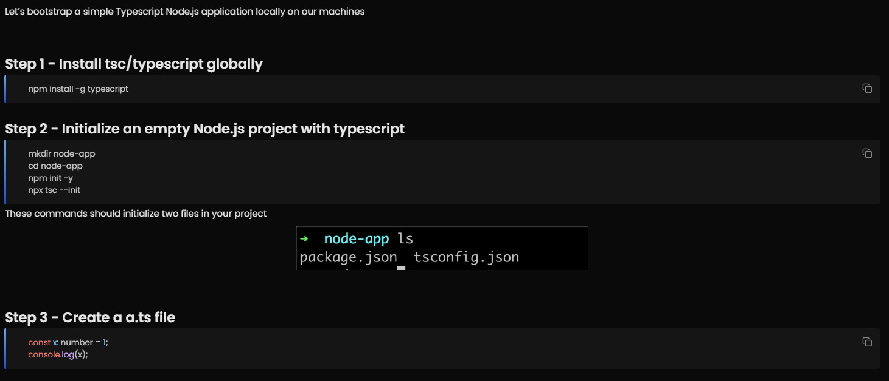
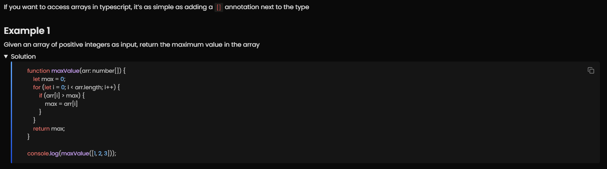
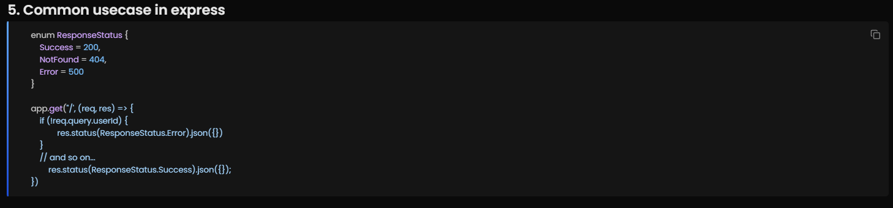

# Step 1: Type of Languages

# Step 2: What is Typescript

# Step 3: The tsc compiler

# Step 4: Basic Types in TypeScript

# Step 5: The tsconfig file

# Step 6: Interfaces

# Step 7: Types

# Step 8: Arrays in TS

# Step 9: Enums

